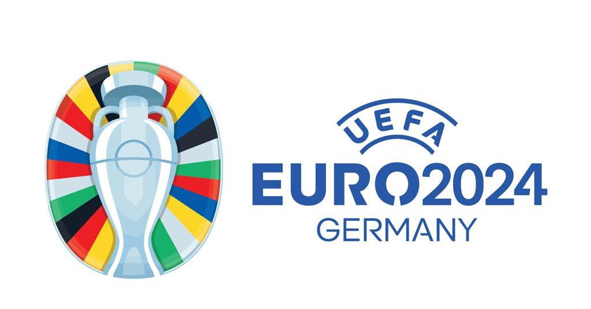

# Euros 2024 Player Shot Map Dashboard

## Overview

The **Euros 2024 Player Shot Map Dashboard** is a dynamic visualisation tool built using Streamlit and MPL Soccer. It allows users to explore player shot data from the Euros 2024 tournament, helping analysts and fans better understand shooting trends, player performance, and match outcomes.

## Features

- Interactive shot map for any player and team from the tournament.
- Detailed summary of goals, missed shots, and penalties.
- Separation of regular play penalties and shootout penalties.
- Easy-to-use dropdowns for team and player selection.

## Data Sources

The shot data used in this project comes from the Euros 2024 tournament, focusing on team and player performances across all matches.

## Visualisation Preview

Here's a quick preview of the Streamlit app in action:

## How It Works

The dashboard offers the following functionality:
- Select a team and player to view their shot locations on the pitch.
- Visual differentiation of goals, missed shots, and penalties.
- Clear layout that initially displays the pitch before team and player selection.

